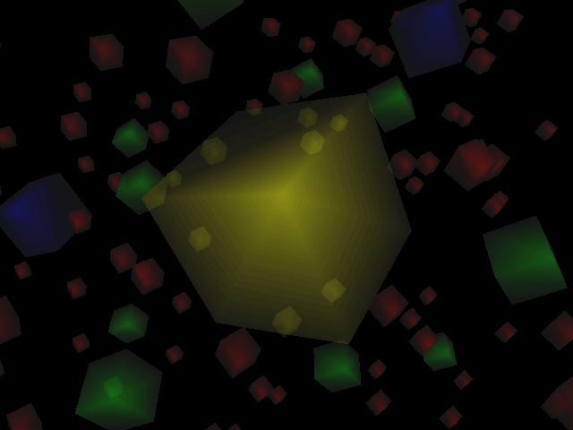

|  |  |
|------------------------------------------------|---------------------------------------------------|
|  |     |
|    |       |

A neat, portable, realtime 3D rendering library originally created between
1996 and 2000 by Justin Frankel and Nullsoft, Inc.

This version has been updated with some minor modernization tweaks, including
the use of `stdint.h` and packaging through CMake and pkg-config. The original
examples have also been ported to SDL2 and SDL3.

Original homepage: [1014.org](http://1014.org/code/nullsoft/plush/)

Archived homepage: [nullsoft.com](https://web.archive.org/web/19990221124147/http://nullsoft.com/plush/)

## Notes

- [Eggbug model created by Xenon Fossil](https://xenonfossil.itch.io/low-poly-eggbug)

## Features

- Rasterization:
	- 8bpp only
	- Z-buffer or painters algorithm
	- Solid, Environment, Textured, Perspective Textured, Perspective Environment, Textured Environment, Translucent fills
	- None, Flat, Gouraud, Distance lightshading
- Unlimited number of cameras
	- Pitch, Pan, and Roll control
	- Target tracking
- Unlimited number of point and directional lights, each with own intensity
	- Point lights with distance falloff
- Hierarchical Objects
	- .3DS Mesh Reader
	- .COB Mesh Reader
	- .JAW Mesh Reader
	- .OBJ Mesh Reader (using [fast_obj](https://github.com/thisistherk/fast_obj/))
- Textures
	- PCX texture reader with palette optimization and auto-rescaling
	- Perspective Correct modes have piecewise linear approximation every n pixels.
- Spline interpolation with tension, continuity, and bias control
- 4x4 Matrix manipulation library
- Easy to use, cross-platform API
- Architecture that makes it simple to add new rasterizers

# TODO

- Re-work .3DS file loader to match the OBJ file loader in terms of syntax
- Add .BMP file loader
- Run `clang-format` on all source files
- Vertex colours
- Coloured lights
- Write usage docs

## CMake Configuration Variables

- `PLUSH_BUILD_EXAMPLES`: Set to `OFF` to disable building the example applications
- `PLUSH_USE_ASAN`: Set to `ON` to enable Address Sanitizer on the library and examples
- `PLUSH_MAX_LIGHTS`: Set to any numberic value defining how many lights can be
added to a scene. This value is accessible in code with the `PL_MAX_LIGHTS`
preprocessor macro. Default: 32
- `PLUSH_MAX_TRIANGLES`: Set to any numberic value defining how many triangles
can be rendered in a scene. This value is accessible in code with the
`PL_MAX_TRIANGLES` preprocessor macro. Default: 16384

# Example Programs

- [`duckdemo.c`](./examples/duckdemo.c) - .3DS model loading demo
- [`eggbug.c`](./examples/eggbug.c) - the last migration of the eggbugs
- [`ex1.c`](./examples/ex1.c) - **the most basic example**: an untextured white cube in a black void
- [`ex2.c`](./examples/ex2.c) - an untextured purple cube
- [`ex3.c`](./examples/ex3.c) - a purple cube and a green torus
- [`ex4.c`](./examples/ex4.c) - a texture mapped cube
- [`flurry.c`](./examples/flurry.c) - transparent material showcase
- [`fly.c`](./examples/fly.c) - interactive flight environment
- [`model.c`](./examples/model.c) - another .3DS model loading demo
- [`polyrobo.c`](./examples/polyrobo.c) - high polycount robot model
- [`polyrobo2.c`](./examples/polyrobo2.c) - high polycount robot model in a large lit scene
- [`q3bsp.c`](./examples/q3bsp.c) - quake 3 bsp loader and renderer
- [`reflection.c`](./examples/reflection.c) - real time reflections the old fashioned way
- [`scene.c`](./examples/scene.c) - pre-rendered background and depth buffer example
- [`ship.c`](./examples/ship.c) - a small spaceship tumbling through a sci-fi city's airspace
- [`sprite.c`](./examples/sprite.c) - a transparent plane that always faces the camera (like a sprite)
- [`teapot.c`](./examples/teapot.c) - obligatory utah teapot
- [`texenv.c`](./examples/texenv.c) - environment mapping example
- [`texture.c`](./examples/texture.c) - static texture buffer loading example
- [`triangle.c`](./examples/triangle.c) - a single triangle with gouraud shading and pre-lit vertex intensity

## Portability

Plush is designed to be highly portable. It has been tested to work with the
following compilers:

- gcc 14.2.1
- g++ 14.2.1
- Clang 18.1.8
- TinyCC 0.9.28rc
- cproc #f66a6613
- Open Watcom 1.9
- MSVC 19.44.35207.1
- DJGPP 12.2.0

## License

Copyright (C) 1996-2000, Justin Frankel and Nullsoft, Inc.\
Copyright (C) 2024-2025, erysdren (it/its)

This software is provided 'as-is', without any express or implied warranty. In
no event will the authors be held liable for any damages arising from the use
of this software.

Permission is granted to anyone to use this software for any purpose, including
commercial applications, and to alter it and redistribute it freely, subject to
the following restrictions:

1. The origin of this software must not be misrepresented; you must not claim
that you wrote the original software. If you use this software in a product,
an acknowledgment in the product documentation would be appreciated but is not
required.
2. Altered source versions must be plainly marked as such, and must not be
misrepresented as being the original software.
3. This notice may not be removed or altered from any source distribution.

Justin Frankel
justin@nullsoft.com
