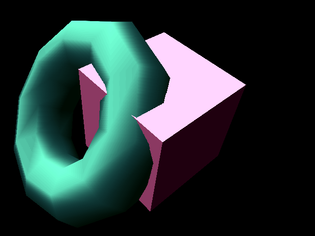
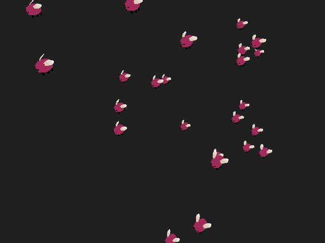

|   |   |
|---|---|
|  |  |
|  |  |

A neat, portable, realtime 3D rendering library originally created between 1996 and 2000 by Justin Frankel and Nullsoft, Inc.

This version has been updated with some minor modernization tweaks, including the use of `stdint.h` and packaging through CMake and pkg-config. The original examples have also been ported to SDL2.

Original homepage: [1014.org](http://1014.org/code/nullsoft/plush/)

## Todo

- Add more format loaders
- Allow library user to override what I/O functions it uses (rather than libc)
- Run clang-format on the code

## Notes

- [Eggbug model created by Xenon Fossil](https://xenonfossil.itch.io/low-poly-eggbug)

## Features

- Rasterization:
	- 8bpp only
	- Z-buffer or painters algorithm
	- Solid, Environment, Textured, Perspective Textured, Perspective Environment, Textured Environment, Translucent fills
	- None, Flat, Gouraud, Distance lightshading
- Unlimited number of cameras
	- Pitch, Pan, and Roll control
	- Target tracking
- Unlimited number of point and directional lights, each with own intensity
	- Point lights with distance falloff
- Hierarchical Objects
	- .3DS Mesh Reader
	- .COB Mesh Reader
	- .JAW Mesh Reader
- Textures
	- PCX texture reader with palette optimization and auto-rescaling
	- Perspective Correct modes have piecewise linear approximation every n pixels.
- Spline interpolation with tension, continuity, and bias control
- 4x4 Matrix manipulation library
- Easy to use, cross-platform API
- Architecture that makes it simple to add new rasterizers

## Portability

Plush is designed to be highly portable. It has been tested to work with the
following compilers:

- gcc 14.2.1
- g++ 14.2.1
- Clang 18.1.8
- TinyCC 0.9.28rc
- cproc #f66a6613
- Open Watcom 1.9

## License

Copyright (C) 1996-1998, Justin Frankel\
Copyright (C) 1998-2000, Nullsoft, Inc.\
Copyright (C) 2024-2025, erysdren (it/its)

This software is provided 'as-is', without any express or implied warranty. In no event will the authors be held liable for any damages arising from the use of this software.

Permission is granted to anyone to use this software for any purpose, including commercial applications, and to alter it and redistribute it freely, subject to the following restrictions:

1. The origin of this software must not be misrepresented; you must not claim that you wrote the original software. If you use this software in a product, an acknowledgment in the product documentation would be appreciated but is not required.
2. Altered source versions must be plainly marked as such, and must not be misrepresented as being the original software.
3. This notice may not be removed or altered from any source distribution.

Justin Frankel
justin@nullsoft.com
